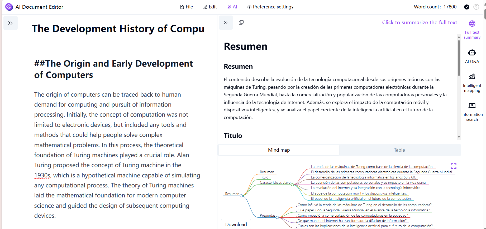
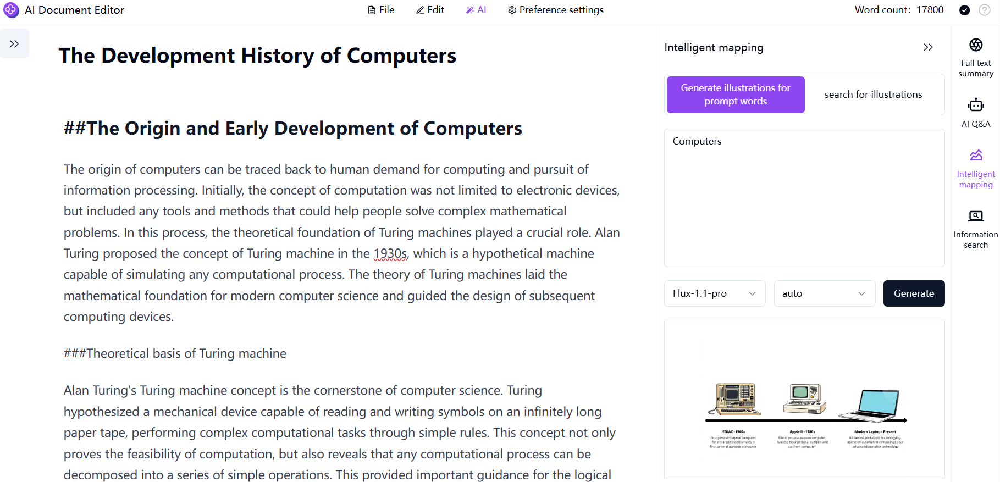
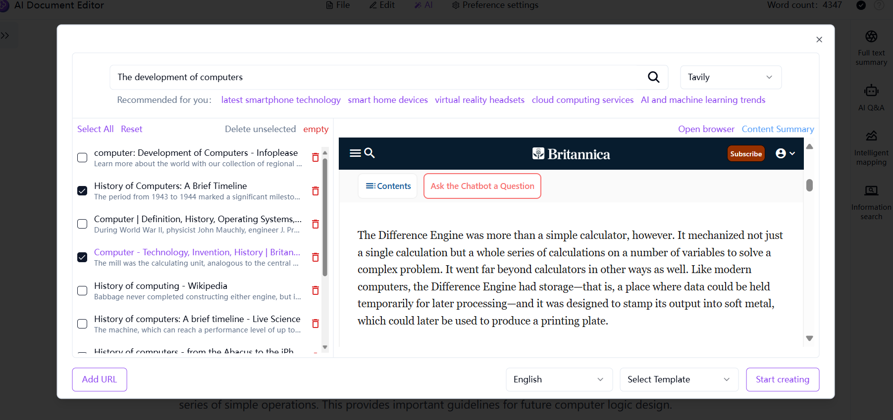
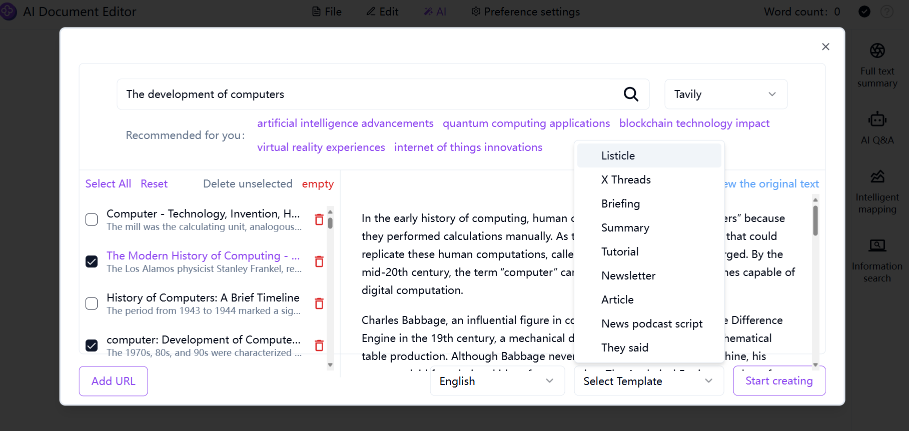
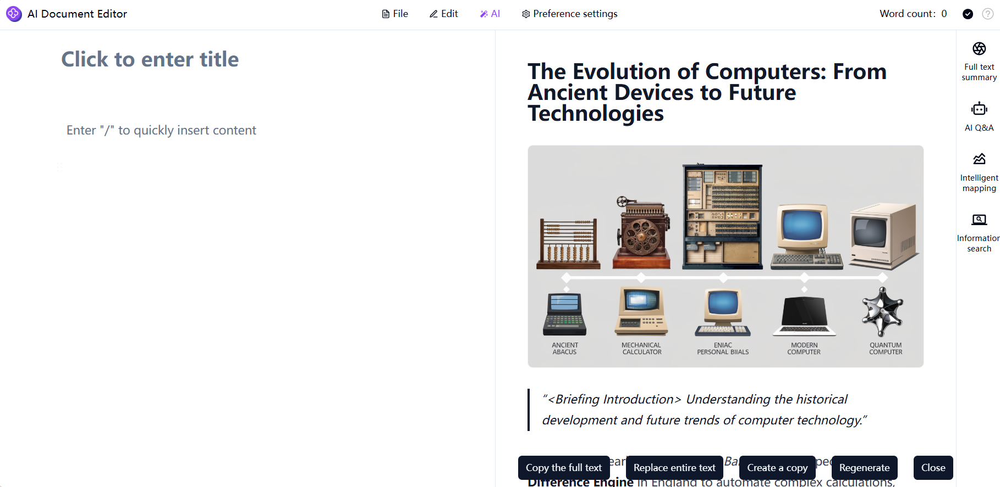

# 
💻 AI Document Editor 🚀✨

The AI document editor utilizes large language models to assist users in long-text creation, offering an editing experience similar to that of Word. It provides high-quality AI functions such as full-text summarization, full-text translation, full-text rewriting, full-text reading aloud, intelligent image matching, and one-click generation of long texts. It also offers nine stylized document templates for selection and supports exporting documents in multiple formats. 

<a href="README zh.md">中文</a> | <a href="README.md">English</a> | <a href="README_ja.md">日本語</a>

This is the open-source version of [AI Document Editor](https://302.ai/tools/word/) from [302.AI](https://302.ai).
You can directly log in to 302.AI to use the online version with zero code and zero configuration.
Or modify this project according to your needs, input 302.AI's API KEY, and deploy it yourself.

## Interface Preview
Full-text summarization function: Based on the document, the AI automatically summarizes the full text and generates article abstracts, mind maps and tables.
       

Intelligent image matching function: It can search for illustrations, and also generate illustrations by inputting prompts. Users can freely choose the image generation model and size ratio.
     

Information search function: According to the input description, the left column generates articles, news, website addresses and other information corresponding to the information, while the right column displays the content of the information and generates content abstracts.
     

Template stylization function: There are a variety of stylized document templates available for selection.
     

Taking the briefing as an example, based on the selected information, the AI automatically summarizes and generates the briefing.

## Project Features

### 🤖 AI Smart Assistant
- **Intelligent Translation**: Supports multiple language translations
- **Content Rewriting**: Smart content rewriting while maintaining original meaning
- **Smart Summarization**: Automatically generates full text or paragraph summaries
- **AI Illustrations**: Automatically generates relevant illustrations based on text content
- **Information Retrieval**: Smart search and summary generation of information
- **One-click generation of long text**：Automatically generate a long text based on the title.

### ✍️ Text Editing Enhancement
- **Paragraph Processing**
  - Smart rewriting
  - Automatic summarization
  - Multi-language translation
  - Content expansion
  - Smart compression
  - Context continuation
- **Editing Operations**
  - Text replacement
  - Smart insertion
  - Quick copy

  ### 🌟 Stylization of document templates
- List article
- Twitter timeline
- Briefing
- Summary
- Tutorial
- Press release
- Article
- Information podcast script
- They say

### 🌍 Multi-language Support
- Chinese Interface
- English Interface
- Japanese Interface

Through the AI document editor, we can provide all-round support for creation, including functions such as multilingual translation, content rewriting, intelligent summarization, and illustration generation, making the creation process smoother and more efficient. The document editor offers nine templates, and we can choose the appropriate template for creation according to the document type to enrich the editing of documents.  🎉💻 Let's explore the new world of AI-driven code together! 🌟🚀

## 🚩 Future update plans
- [ ] Release more document templates for selection
- [ ] Add a text editing format painter function to quickly copy the format of text or objects and apply it to other text or objects
- [ ] Add an AI grammar and spelling correction function to intelligently identify and correct grammar or spelling errors in the text

## 🛠️ Tech Stack
Frontend Framework: Next.js  
Editor Core: Novel.js  
Internationalization: next-i18next  

## Development & Deployment
1. Clone project `git clone https://github.com/302ai/302_document_editor`
2. Install dependencies `pnpm install`
3. Configure 302's API KEY (refer to .env.example)
4. Run project `pnpm dev`
5. Build and deploy `docker build -t document-editor . && docker run -p 3000:3000 302_document-editor`

## ✨ About 302.AI ✨
[302.AI](https://302.ai) is a pay-as-you-go AI application platform, solving the last mile problem of AI practical applications for users.
1. 🧠 Combines the latest and most comprehensive AI capabilities and brands, including but not limited to language models, image models, voice models, and video models.
2. 🚀 Develops deep applications on basic models - we develop real AI products, not just simple chatbots
3. 💰 Zero monthly fee, all features are pay-per-use, fully open, achieving truly low barriers with high potential.
4. 🛠 Powerful management backend for teams and SMEs, one person manages, multiple people use.
5. 🔗 All AI capabilities provide API access, all tools are open source and customizable (in progress).
6. 💡 Strong development team, launching 2-3 new applications weekly, daily product updates. Developers interested in joining are welcome to contact us
