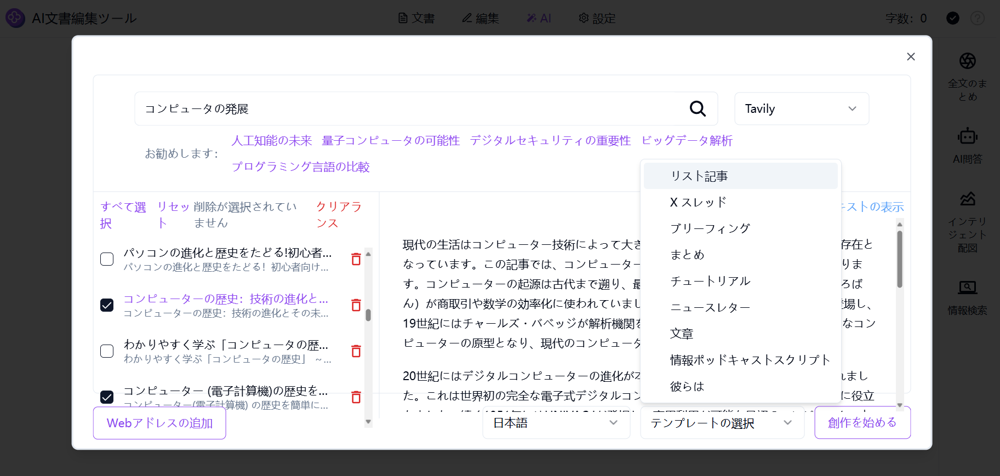

# 
💻 AIドキュメントエディター 🚀✨

AIドキュメントエディターは、大規模言語モデルを利用してユーザーが長文の創作を行う際に支援し、Wordに似た編集体験を提供します。また、高品質なAIによる全文要約、全文翻訳、全文書き換え、全文朗読、インテリジェントな画像付け、長文を一括生成する機能を提供し、9種類のスタイル化されたドキュメントテンプレートを選択できるようにし、ドキュメントを多種多様なフォーマットでエクスポートすることもサポートしています。 

<a href="README_zh.md">中文</a> | <a href="README.md">English</a> | <a href="README_ja.md">日本語</a>

  

[302.AI](https://302.ai)の[AIドキュメントエディター](https://302.ai/ja/tools/word/)のオープンソース版です。
302.AIに直接ログインして、コードやコンフィグ不要でオンライン版を使用できます。
または、このプロジェクトを自身のニーズに合わせて修正し、302.AIのAPI KEYを入力して、独自にデプロイすることもできます。

## インターフェースプレビュー
全文要約機能：ドキュメントに基づいて AI が自動的に全文を要約し、文章の概要、マインドマップと表を生成します。
    

インテリジェントな画像付け機能：イラストを検索できるだけでなく、キーワードを入力してイラストを生成することもでき、画像生成モデルとサイズの比率を自由に選択できます。
     

情報検索機能：入力した説明に基づいて、左欄に対応する情報の文章、ニュース、ウェブサイトのアドレスなどの情報が生成され、右欄に情報の内容が表示され、内容の概要が生成されます。
    

テンプレートスタイル化機能：様々なスタイル化されたドキュメントテンプレートが選択できます。
     

例えばブリーフィングの場合、選択した情報に基づいて AI が自動的にブリーフィングを要約して生成します。
   

## プロジェクトの特徴

### 🤖 AIスマートアシスタント
- **インテリジェント翻訳**: 多言語翻訳をサポート
- **コンテンツ書き換え**: 原意を保ちながらスマートな内容の書き換え
- **スマート要約**: 全文または段落の要約を自動生成
- **AIイラスト**: テキスト内容に基づく関連イラストの自動生成
- **情報検索**: スマートな情報検索と要約生成
- **タイトルに基づいて長文を自動生成**：タイトルに基づいて長文を自動的に生成する

### ✍️ テキスト編集機能
- **段落処理**
  - スマート書き換え
  - 自動要約
  - 多言語翻訳
  - 内容の拡張
  - スマート圧縮
  - 文脈継続
- **編集操作**
  - テキスト置換
  - スマート挿入
  - クイックコピー

### 🌟 ドキュメントテンプレートのスタイル化
- リスト記事
- ツイッターイベントライン
- ブリーフィング
- まとめ
- チュートリアル
- プレスリリース
- 記事
- 情報ポッドキャストスクリプト
- 彼らが言うこと

### 🌍 多言語サポート
- 中国語インターフェース
- 英語インターフェース
- 日本語インターフェース

AIドキュメントエディターを通じて、私たちは創作に全方位のサポートを提供することができます。多言語翻訳、内容書き換え、インテリジェントな要約、画像生成などの機能を含み、創作プロセスをよりスムーズで効率的にします。ドキュメントエディターは9種類のテンプレートを提供しており、私たちはドキュメントの種類に応じて適切なテンプレートを選択して創作を行い、ドキュメントの編集を豊かにすることができます。 🎉💻 一緒にAI駆動の新しいコードの世界を探検しましょう！ 🌟🚀

## 🚩 将来のアップデート計画
- [ ] より多くのドキュメントテンプレートを追加して選択できるようにする
- [ ] テキスト編集用のフォーマットブラシ機能を新たに追加し、テキストやオブジェクトのフォーマットを素早くコピーし、他のテキストやオブジェクトに適用できるようにする
- [ ] AI による文法とスペルの修正機能を新たに追加し、テキスト中の文法やスペルの誤りをインテリジェントに識別して修正する

## 🛠️ 技術スタック
フロントエンドフレームワーク: Next.js  
エディターコア: Novel.js  
国際化: next-i18next  

## 開発とデプロイ
1. プロジェクトのクローン `git clone https://github.com/302ai/302_document_editor`
2. 依存関係のインストール `pnpm install`
3. 302のAPI KEYを設定（.env.exampleを参照）
4. プロジェクトの実行 `pnpm dev`
5. ビルドとデプロイ `docker build -t document-editor . && docker run -p 3000:3000 302_document-editor`

## ✨ 302.AIについて ✨
[302.AI](https://302.ai)は、従量課金制のAIアプリケーションプラットフォームで、ユーザーのAI実践における最後の1マイルの課題を解決します。
1. 🧠 言語モデル、画像モデル、音声モデル、動画モデルなど、最新かつ包括的なAI機能とブランドを集約
2. 🚀 基本モデルに基づく深層アプリケーション開発 - 単なるチャットボットではなく、本物のAI製品を開発
3. 💰 月額料金なし、すべての機能が従量課金制、完全オープンで、真に低い参入障壁と高い可能性を実現
4. 🛠 チームや中小企業向けの強力な管理バックエンド、1人で管理、複数人で使用可能
5. 🔗 すべてのAI機能にAPIアクセスを提供、すべてのツールはオープンソースでカスタマイズ可能（進行中）
6. 💡 強力な開発チーム、週2-3個の新アプリケーションをリリース、製品は毎日更新。参加に興味のある開発者も歓迎
